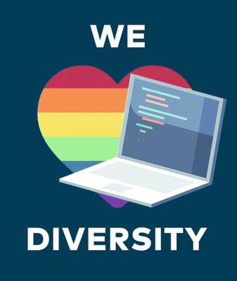

## Hi there ! 

I'm a software engineer with a passion for almost everything tech or education related. My experience is mostly in developing websites, mobile applications and solutions for data analysis and deep learning. Nevertheless, I'm always willingly to expand and learn to act in other areas, after all, knowledge is the key.

I also believe that every solution to a problem, every project, every business or enterprise, is made by people and to serve a purpose for people. Therefore I really believe in the importance of diversity and in the importance of the individuals themselves.

## Contact me at

&nbsp;&nbsp;

